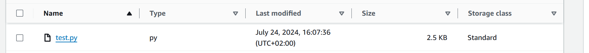

# upload-bigfiles-s3aws-java

I created a class named `S3Uploader` that contains the functions for uploading files, either as a single upload or using multipart upload, based on the file size.

### Key Methods:
- **`uploadFile` Method:** Checks the file size and decides whether to use `singleUpload` or `multipartUpload`.
- **`singleUpload` Method:** Handles the upload of files smaller than or equal to 5 GB using a single `putObject` call (similar to the existing method in your legacy app).
- **`multipartUpload` Method:** A new method added to handle the upload of files larger than 5 GB using the multipart upload approach.

### Tests Conducted:
- **Small Files:** Uploaded text files successfully.
- **Large Files:** Uploaded large files, such as an ISO image, successfully using the appropriate method.

